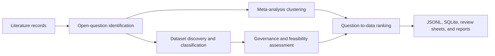

# Architecture

LitDataMatcher is organized as a node pipeline. Each node has a narrow contract,
writes inspectable artifacts, and can be evaluated independently.

## Node Flow

## 1. Open-Question Identification

Implemented in `litdatamatcher.literature`.

Inputs:

- Title
- Abstract
- Full text when available
- DOI or source identifier

Outputs:

- `QuestionCandidate`
- Evidence spans
- Required variable hints
- Domain terms
- Population hints
- Confidence, novelty, significance, and answerability scores

The current extractor is deterministic and rule/lexical based. It is designed
to be augmented by classifiers or language-model adjudication while keeping the
same output schema.

## 2. Meta-Analysis Node

Implemented in `litdatamatcher.meta_analysis`.

This node clusters questions that address the same underlying research gap and
computes a lightweight synthesis:

- Recurrence across sources
- Evidence support count
- Cluster uncertainty
- Evidence strength

The current version does not estimate effect sizes. A future production version
should add structured extraction for design, cohort, exposure, comparator,
outcome, effect direction, and confidence intervals.

## 3. Dataset Scraping and Classification Node

Implemented in `litdatamatcher.datasets`.

The current default adapter is an offline curated biomedical catalog so the
pipeline is reproducible without API keys or network access. The same adapter
interface supports future live sources such as GEO, SRA, MGnify, Qiita,
ClinicalTrials.gov, dbGaP, OpenAlex-linked supplementary data, and domain
repositories.

Every dataset is normalized into:

- Stable dataset ID
- Source and URL
- Variables with categories and completeness
- Population and organism metadata
- Assay types
- Sample size
- Access/licensing metadata
- Quality score

## 4. Question-Significance to Available-Data Ranking Node

Implemented in `litdatamatcher.ranking`.

The ranking node computes an explainable composite from:

- Literature significance
- Variable overlap
- Semantic relevance
- Population fit
- Dataset quality
- Sample adequacy
- Feasibility
- Evidence uncertainty penalty
- Governance reuse
- Design fit

The output includes both component scores and plain-language rationale so ranked
opportunities can be audited.

## 5. Governance And Feasibility Nodes

Implemented in `litdatamatcher.governance` and `litdatamatcher.feasibility`.

These nodes assess:

- access and license clarity
- human-subject reuse risk
- required-variable coverage
- population compatibility
- sample adequacy
- longitudinal and assay fit
- recommended statistical design
- caveats requiring expert review

## 6. Storage, Review, Evaluation, And Reporting

Implemented in `litdatamatcher.storage` and `litdatamatcher.pipeline`.

Each run writes:

- JSONL files for versionable node outputs
- SQLite database for queryable local review
- Markdown summary for quick inspection
- Metrics JSONL for run accounting
- Expert review CSV/JSONL sheets
- Evaluation JSONL against gold annotations
- Manuscript-style Markdown reports

This makes the pipeline suitable for manuscript supplements, ablation studies,
and reruns over evolving corpora.
