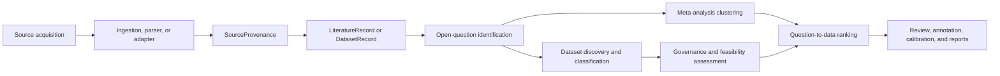

# Architecture

LitDataMatcher is organized as a node pipeline. Each node has a narrow contract,
writes inspectable artifacts, and can be evaluated independently.

The canonical production implementation lives in `litdatamatcher/`. Historical
prototype code is preserved outside the package namespace so it can be reviewed
or cannibalized without confusing the supported path:

- `archive/legacy_literature/`: original literature analyzer, extraction
  helpers, legacy schemas, and historical tests.
- `workflows/legacy_streaming/`: original subprocess streaming workflow.
- `training/`: experimental classifier-training scripts.
- `data/legacy_training/` and `models/legacy/`: preserved historical training
  data and model artifacts.

These legacy locations are not required for the deterministic package demo or
the main `litdatamatcher` CLI.

## Node Flow



## Source And Provenance Pathway

Source/provenance flow is:

```text
source acquisition
  -> ingestion/parser/adapter
  -> SourceProvenance
  -> LiteratureRecord or DatasetRecord
  -> QuestionCandidate metadata
  -> MatchCandidate/review artifacts
  -> annotation and calibration artifacts
  -> reports
```

This pathway preserves evidence depth. Structured JATS/PMC or GROBID TEI full
text, PubMed abstract metadata, OpenAlex scholarly metadata, ClinicalTrials.gov
trial metadata, curated offline dataset metadata, GEO/MGnify dataset metadata,
and derived capability catalog
entries are different evidence classes. Reports and review exports should keep
those differences visible rather than treating all source records as equally
strong.

The detailed source-ingestion contract, controlled vocabulary, and adapter and
parser checklists are documented in `docs/source_ingestion_and_provenance.md`.

## 1. Open-Question Identification

Implemented in `litdatamatcher.literature`.

Local text, Markdown, PDF, JATS/PMC XML, GROBID TEI XML, generic XML, or
existing JSONL sources can first be converted to pipeline-ready literature
records with `litdatamatcher.ingestion` or `litdatamatcher ingest`. This
preprocessing step does not perform question extraction; it only creates
reproducible `title`, `abstract`, `text`, and source-provenance records for the
canonical pipeline. Each ingestion run also writes a JSON manifest and Markdown
report so source files, skipped files, content hashes, and document grouping
keys can be audited before downstream question extraction.

Inputs:

- Title
- Abstract
- Full text when available
- DOI or source identifier

Outputs:

- `QuestionCandidate`
- Evidence spans
- Required variable hints
- Domain terms
- Population hints
- Extraction confidence, novelty, significance, and answerability scores

The current extractor is deterministic and rule/lexical based. It is designed
to be augmented by classifiers or language-model adjudication while keeping the
same output schema.

## 2. Meta-Analysis Node

Implemented in `litdatamatcher.meta_analysis`.

This node clusters questions that address the same underlying research gap and
computes a lightweight synthesis:

- Recurrence across sources
- Evidence support count
- Cluster uncertainty
- Evidence strength

The current version does not estimate effect sizes. A future production version
should add structured extraction for design, cohort, exposure, comparator,
outcome, effect direction, and confidence intervals.

## 3. Dataset Scraping and Classification Node

Implemented in `litdatamatcher.datasets`.

The current default adapter is an offline curated biomedical catalog so the
pipeline is reproducible without API keys or network access. The same adapter
interface supports future live sources such as GEO, SRA, MGnify, Qiita,
ClinicalTrials.gov, dbGaP, OpenAlex-linked supplementary data, and domain
repositories. Optional live metadata adapters currently expose PubMed/OpenAlex
literature metadata and ClinicalTrials.gov/GEO/MGnify dataset metadata through
separate search commands; these outputs require source-specific validation
before publication use. Dataset metadata records are catalog descriptions, not
downloaded or analyzed datasets. Built-in catalog records carry advisory
provenance so reports can distinguish curated metadata from live adapter output.

Every dataset is normalized into:

- Stable dataset ID
- Source and URL
- Variables with categories and completeness
- Population and organism metadata
- Assay types
- Sample size
- Access/licensing metadata
- Quality score

Dataset capability export is implemented in `litdatamatcher.capability_registry`.
It separates observed metadata variables from plausibly derived capabilities,
such as treatment response, longitudinal change, survival-style outcomes, or
BMI. These records describe what may be possible; they do not perform the
underlying statistical analysis.

## 4. Question-Significance to Available-Data Ranking Node

Implemented in `litdatamatcher.ranking`.

The ranking node computes an explainable composite from:

- Literature significance
- Variable overlap
- Semantic relevance
- Population fit
- Dataset quality
- Sample adequacy
- Feasibility
- Evidence uncertainty penalty
- Governance reuse
- Design fit

The output includes both component scores and plain-language rationale so ranked
opportunities can be audited.

## 5. Governance And Feasibility Nodes

Implemented in `litdatamatcher.governance` and `litdatamatcher.feasibility`.

These nodes assess:

- access and license clarity
- human-subject reuse risk
- required-variable coverage
- population compatibility
- sample adequacy
- longitudinal and assay fit
- recommended statistical design
- caveats requiring expert review

## 6. Storage, Review, Evaluation, And Reporting

Implemented in `litdatamatcher.storage` and `litdatamatcher.pipeline`.

Each run writes:

- JSONL files for versionable node outputs
- SQLite database for queryable local review
- Markdown summary for quick inspection
- Metrics JSONL for run accounting
- Expert review CSV/JSONL sheets
- Evaluation JSONL against gold annotations
- Manuscript-style Markdown reports

This makes the pipeline suitable for manuscript supplements, ablation studies,
and reruns over evolving corpora.

Completed review sheets can also be normalized into annotation-training
artifacts with `litdatamatcher annotation-export`. The file contract for those
labels, QA artifacts, optional train/validation/test splits, and readiness
metadata is documented in `docs/annotation_export_schema.md`.
